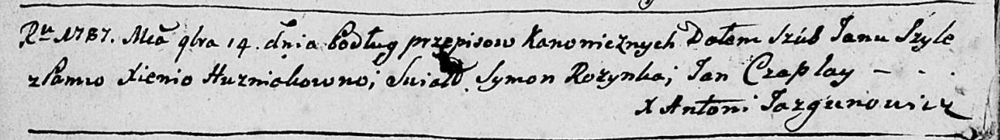
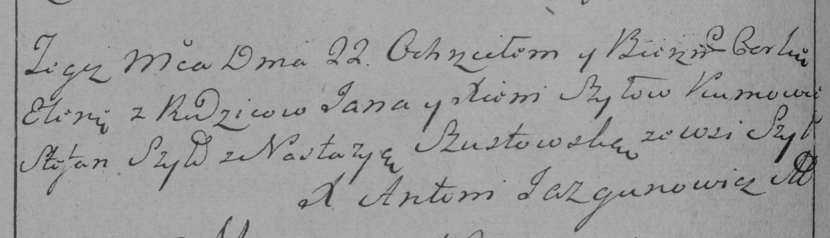
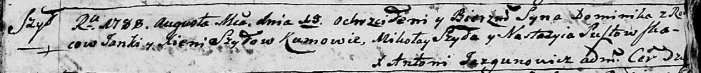
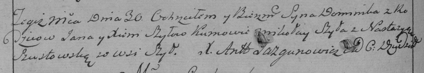
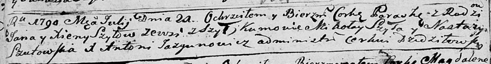
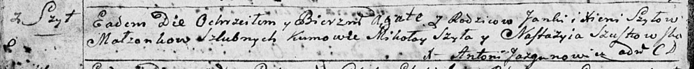

**Шило Ян (Szyło Janka, Jan)**

14 ноября 1787 г -- венчание с Ксеней Гузняк (НИАБ 136-13-894, лист
66об, №16/1787-б (ориг)).

22 октября 1784 г -- крещение дочери Елены (РГИА 823-2-18, лист 227об,
№22/1784-р (коп)).

19 августа 1788 г -- крещение сына Доминика (НИАБ 136-13-894, лист 5,
№46/1788-р (ориг)), (РГИА 823-2-18, лист 236об, №24/1788-р (коп)).

21 июля 1790 г -- крещение дочери Параски (НИАБ 136-13-894, лист 10об,
№47/1790-р (ориг)).

14 ноября 1792 г -- крещение дочери Агаты (НИАБ 136-13-894, лист 17об,
№75/1792-р (ориг)).

**НИАБ 136-13-894:** Лист 66об. **Метрическая запись №16/1787-б
(ориг).**

Дедиловичская Покровская церковь. 14 ноября 1787 года. Метрическая
запись о венчании.

Szyło Jan -- жених с деревни \[Шилы\].

Huzniakowna Xienia -- невеста.

Rozynka Symon -- свидетель.

Czaplay Jan -- свидетель.

Jazgunowicz Antoni -- ксёндз.

**РГИА 823-2-18:** Лист 227об. **Метрическая запись №22/1784-р (коп).**

Дедиловичская Покровская церковь. 22 октября 1784 года. Метрическая
запись о крещении.

Szyłowna Elena -- дочь родителей с деревни Шилы.

Szyło Jan -- отец.

Szyłowa Xienia -- мать.

Szyło Stefan -- кум.

Szustowska Nastazya - кума.

Jazgunowicz Antoni -- ксёндз.

**НИАБ 136-13-894:** Лист 5. **Метрическая запись №46/1788-р (ориг).**

Дедиловичская Покровская церковь. 19 августа 1788 года. Метрическая
запись о крещении.

Szyło Dominik -- сын родителей с деревни Шилы.

Szyło Janka -- отец.

Szyłowa Xienia -- мать.

Szyło Mikołay - кум.

Susztowska Nastazyia - кума.

Jazgunowicz Antoni -- ксёндз.

**РГИА 823-2-18:** Лист 236об. **Метрическая запись №24/1788-р (коп).**

Дедиловичская Покровская церковь. 30 августа 1788 года. Метрическая
запись о крещении.

Szyło Dominik -- сын родителей с деревни Шилы.

Szyło Jan -- отец.

Szyłowa Xienia -- мать.

Szyło Mikołay -- кум.

Szustowska Nastazya - кума.

Jazgunowicz Antoni -- ксёндз.

**НИАБ 136-13-894:** Лист 10об. **Метрическая запись №47/1790-р
(ориг).**

Дедиловичская Покровская церковь. 21 июля 1790 года. Метрическая запись
о крещении.

Szyłowna Paraska -- дочь родителей с деревни Шилы.

Szyło Jan -- отец.

Szyłowa Xienia -- мать.

Szyło Mikołay - кум.

Szutowska Nastazya - кума.

Jazgunowicz Antoni -- ксёндз.

**НИАБ 136-13-894:** Лист 17-об. **Метрическая запись №75/1792-р
(ориг).**

Дедиловичская Покровская церковь. 14 ноября 1792 года. Метрическая
запись о крещении.

Szyłowna Agata -- дочь родителей с деревни Шилы.

Szyło Janka -- отец.

Szyłowa Xienia -- мать.

Szyło Mikolay - кум.

Szustowska Nastazyia - кума.

Jazgunowicz Antoni -- ксёндз.
