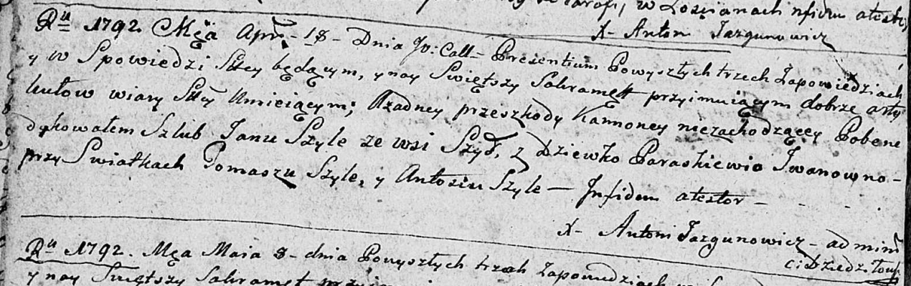
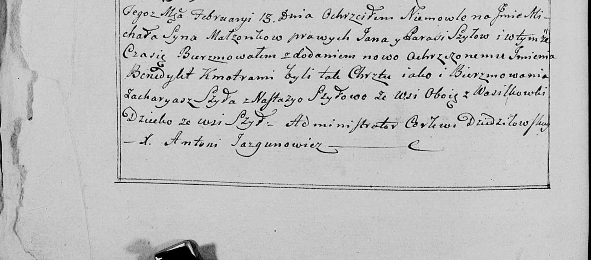

**Шило Параскевия, Парася дочь Ивана (Szyłowa Paraskiewija, Parasia
Jwanowna)**

18 апреля 1792 года -- венчание с Яном Шило с деревни Шилы (НИАБ
136-13-894, лист 70об, №6/1792-б (ориг)).

13 февраля 1799 года -- крещение сына Яна Бенедыкта (НИАБ 136-13-938,
лист 240об, №9/1799-б (коп)).

**НИАБ 136-13-894:** Лист 70об. **Метрическая запись №6/1792-б (ориг).**

Дедиловичская Покровская церковь. 18 апреля 1792 года. Метрическая
запись о венчании.

Szyło Jan -- жених, с деревни Шилы.

Jwanowna Paraskiewija -- невеста.

Szyło Tomasz -- свидетель.

Szyło Antoś -- свидетель.

Jazgunowicz Antoni -- ксёндз.

**НИАБ 136-13-938:** Лист 240об. **Метрическая запись №9/1799-р (коп).**

(См. тж. НИАБ 136-13-894, лист 38, №9/1799-р (ориг); РГИА 823-2-18, лист
268об, №9/1799-р (коп))

Дедиловичская Покровская церковь. 13 февраля 1799 года. Метрическая
запись о крещении.

Szyło Michał Benedykt -- сын родителей с деревни Шилы.

Szyło Jan -- отец.

Szyłowa Parasia -- мать.

Szyło Zacharyasz -- кум, с деревни Васильковка.

Szyłowa Nastazya - кума, с деревни Васильковка.

Jazgunowicz Antoni -- ксёндз.
