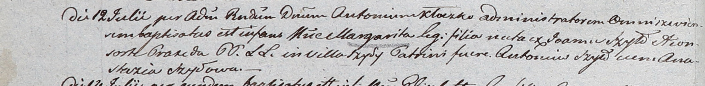

**Шило Маргарита Янова (Szyłowna Margarita)**

12 июля 1803 года -- крещение (НИАБ 937-4-32, лист 9об, №21/1803-р).

**НИАБ 937-4-32:** Лист 9об. **Метрическая запись №21/1803-р.**

{width="6.496527777777778in"
height="0.8in"}

Дедиловичский костел Наисвятейшего Сердца Иисуса. 12 июля 1803 года.
Метрическая запись о крещении.

Szyłowna Margarita -- дочь родителей с деревни Шилы.

Szyło Joann -- отец.

Szyłowa Praxeda -- мать.

Szyło Antoni -- крестный отец.

Szyłowa Anastazia -- крестная мать.

Kłoczko Antoni -- ксёндз, администратор Ошмянского костела.
