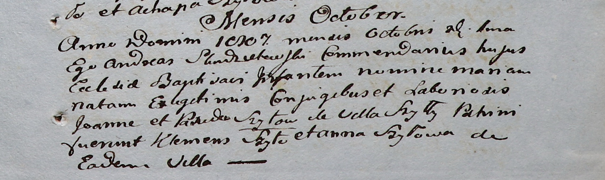

**Шило Ян (Szyło Joann)**

12 июля 1803 года -- крещение дочери Маргариты (НИАБ 937-4-32, лист 9об,
№21/1803-р).

20 октября 1807 года -- крещение дочери Марии (НИАБ 937-4-32, лист 16,
№18/1807-р).

**НИАБ 937-4-32:** Лист 9об. **Метрическая запись №21/1803-р.**

{width="6.496527777777778in"
height="0.8in"}

Дедиловичский костел Наисвятейшего Сердца Иисуса. 12 июля 1803 года.
Метрическая запись о крещении.

Szyłowna Margarita -- дочь родителей с деревни Шилы.

Szyło Joann -- отец.

Szyłowa Praxeda -- мать.

Szyło Antoni -- крестный отец.

Szyłowa Anastazia -- крестная мать.

Kłoczko Antoni -- ксёндз, администратор Ошмянского костела.

**НИАБ 937-4-32:** Лист 16. **Метрическая запись №18/1807-р.**

{width="6.496527777777778in"
height="1.9381944444444446in"}

Дедиловичский костел Наисвятейшего Сердца Иисуса. 20 октября 1807 года.
Метрическая запись о крещении.

Szyłowna Maria -- дочь крестьян с деревни Шилы.

Szyło Joann -- отец.

Szyłowa Paxieda -- мать.

Szyło Klemens -- крестный отец.

Szyłowa Anna -- крестная мать, с деревни Шилы.

Zychowski Gabriel -- ксёндз, комендант Дедиловичский.
