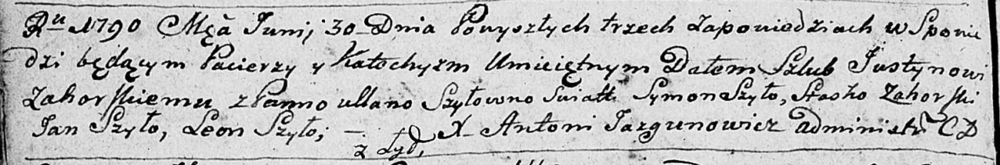

**Загорский Юстын (Zahorski Justyn)**

30 июня 1790 г -- венчание с Ульяной Шило (НИАБ 136-13-894, лист 68об,
№6/1790-б (ориг)).

**НИАБ 136-13-894:** Лист 68об. **Метрическая запись №6/1790-б (ориг).**

Дедиловичская Покровская церковь. 30 июня 1790 года. Метрическая запись
о венчании.

Zahorski Justyn -- жених, с деревни Лыды.

Szyłowna Ullana -- невеста.

Szyło Symon -- свидетель.

Zahorski Stasko -- свидетель.

Szyło Jan -- свидетель.

Szyło Leon -- свидетель.

Jazgunowicz Antoni -- ксёндз.
