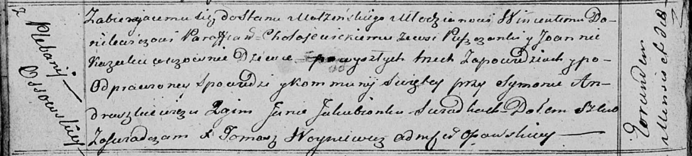

**Данилевич Винценты (Danilewicz Wincenty)**

10 ноября 1818 г -- венчание с девкой Иоанной Казукевич с деревни Осово
(НИАБ 136-13-920, лист 25об, №11/1818-б (ориг)).

**НИАБ 136-13-920:** Лист 25об. **Метрическая запись №11/1818-б
(ориг).**

{width="6.496527777777778in"
height="1.4690780839895012in"}

Осовская Покровская церковь. 10 ноября 1818 года. Запись о венчании.

Danilewicz Wincenty -- жених, молодой, парафии Холойевицкой, с деревни
Пушчонки Плещеницкая волость).

Kazukiewiczowna Joanna -- невеста, девка, с плебании Осовской, с деревни
Осово.

Andruszkiewicz Symon -- свидетель.

Jakubionek Jan -- свидетель.

Woyniewicz Tomasz -- ксёндз.
