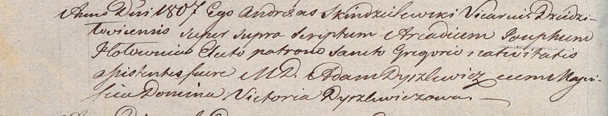

**Головень (Дышлевич) Ангеля (Hołowniowa Angela z Dyszlewiczow)**

18 ноября 1806 г -- крещение сына Иосифа (НИАБ 937-4-32, лист 14об,
№26/1806-р).

**НИАБ 937-4-32:** Лист 14об. **Метрическая запись №26/1806-р.**

{width="6.496527777777778in"
height="1.8284722222222223in"}

{width="6.496527777777778in"
height="1.2486111111111111in"}

Дедиловичский костел Наисвятейшего Сердца Иисуса. 18 ноября 1806 года.
Метрическая запись о крещении.

Hołowien Joseph -- сын шляхтичей с господского дома Прусевичи.

Hołowien Xaveri -- отец.

Hołowniowa Angela z Dyszlewiczow -- мать.

Ławrowski Leon -- крестный отец, шляхтич.

Parchamowiczowna Victoria -- крестная мать, шляхтянка, со двора
Глебовщизна.

Dyszlewicz Adam - ассистент, шляхтич.

Dyszlewiczowa Victoria - ассистентка, шляхтянка.

Skindzelewski Andreas -- ксёндз, викарий Дедиловичский.
