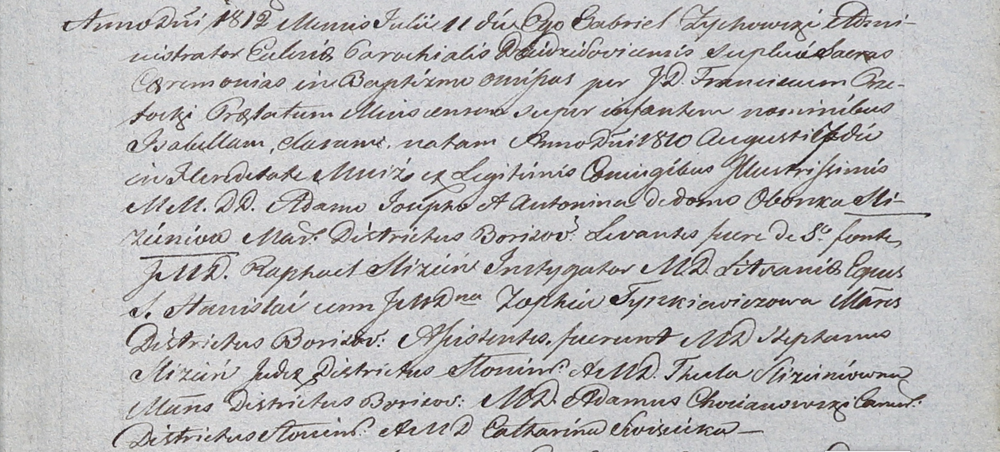

**Тышкевич Зофия (Tyszkiewiczowa Zophia)**

11 июля 1812 г -- крестная мать Изабеллы, дочери шляхтичей Адама и
Антонины Слизеней с имения Мстиж (НИАБ 937-4-32, лист 25, №18/1812-р).

**НИАБ 937-4-32:** Лист 25. **Метрическая запись №18/1812-р.**

Дедиловичский костел Наисвятейшего Сердца Иисуса. 11 июля 1812 года.
Метрическая запись о крещении.

Slizieniowna Jsabełła -- дочь шляхтичей со двора Мстиж, родилась в
Мстиже 7 августа 1810 года.

Slizien Adam Joseph -- отец.

Slizieniowa Antonina z Obonkow -- мать.

Slizien Raphael -- крестный отец, шляхтич, инстигатор Литовский, кавалер
ордена св. Станислава.

Tyszkiewiczowa Zophia -- крестная мать, шляхтянка, с города Борисова.

Slizien Stephan -- ассистент, шляхтич, с города Слонима.

Slizieniowna Thecla -- ассистентка, шляхтянка, с города Борисова.

Chocianowski Adam - ассистент, шляхтич, с города Слонима.

Siviscicka Catharina - ассистентка, шляхтянка.

Zychowski Gabriel -- ксёндз.

Przetocki Francisc -- ксёндз, прелат Мстижский.
