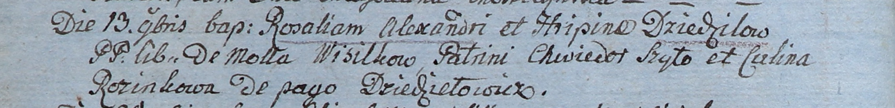

**Дедило Грипина (Dziedziłowa Hripina)**

13 ноября 1805 г -- крещение дочери Розалии (НИАБ 937-4-32, лист 12об,
№41/1805-р).

**НИАБ 937-4-32:** Лист 12об. **Метрическая запись №41/1805-р.**

Дедиловичский костел Наисвятейшего Сердца Иисуса. 13 ноября 1805 года.
Метрическая запись о крещении.

Dziedziłowna Rosalia -- дочь вольных людей с деревни? Висильки.

Dziedziło Alexander -- отец.

Dziedziłowa Hripina -- мать.

Szyło Chwiedor -- крестный отец.

Rozinkowa Culina -- крестная мать, с деревни Дедиловичи.

Linhart Hiacinthus -- ксёндз.
